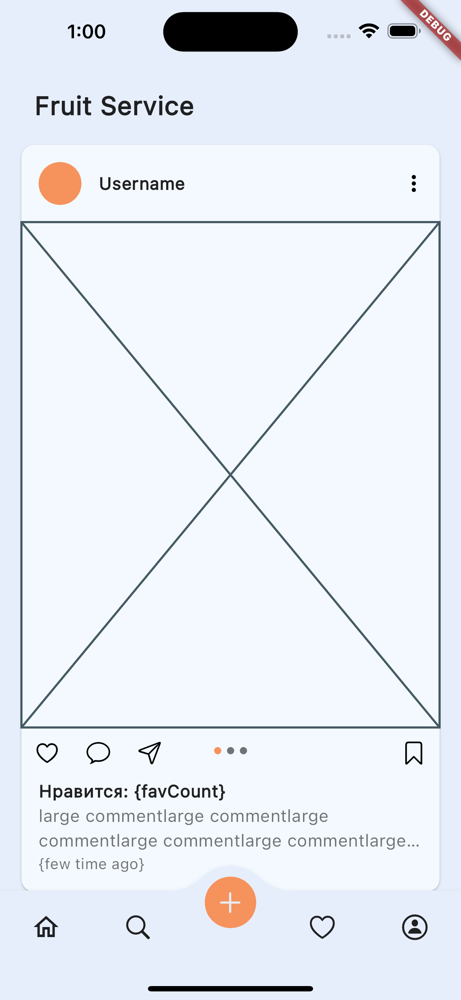
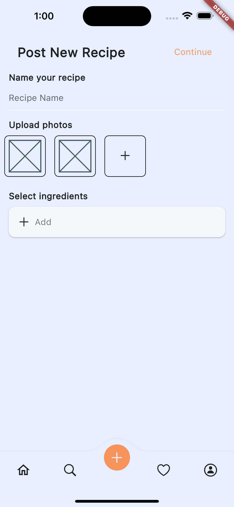
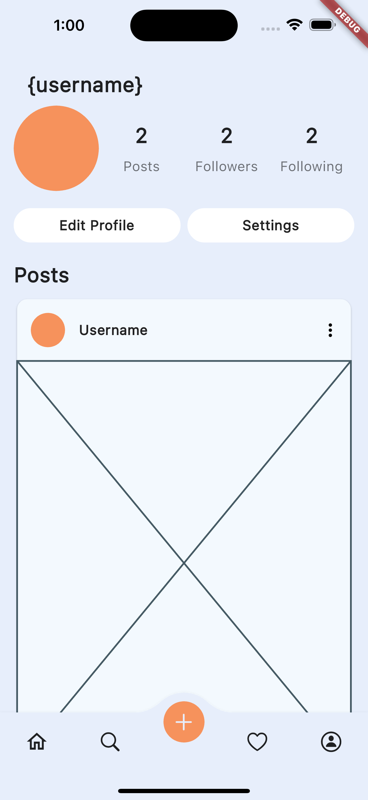

# Recipe

### Store your recipes and see what others are up to on our application

## Status
<div>
    
    
    
</div>

## How-To Build
```
clone https://github.com/pocket-red-fox/Recipe-Service.git
mv ./Recipe-Service ./recipe && cd ./recipe
flutter pub get
flutter packages pub run build_runner build
flutter run
```

! Do not forget to update the Firebase configuration
